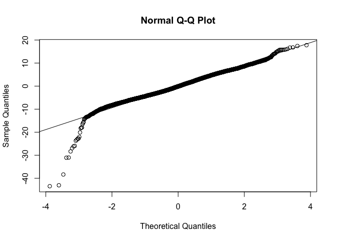

PSTAT 126 FINAL PROJECT
================
Helen Cui, Becky Su, Sarah Hermann
3/14/2019

``` r
library(readxl)
library(car)
```

    ## Loading required package: carData

``` r
data.ccpp<-read_excel("/Users/beckysu/Desktop/ccpp.xlsx")
data(data.ccpp)
```

    ## Warning in data(data.ccpp): data set 'data.ccpp' not found

``` r
attach(data.ccpp)

a<-data.ccpp$AT
b<-data.ccpp$V
c<-data.ccpp$AP
d<-data.ccpp$RH
Y<-data.ccpp$PE
```

``` r
pairs(~Y+a+b+c+d)
```

<!-- -->

``` r
full.lm<-lm(Y~a+b+c+d)
avPlots(full.lm, id=FALSE)
```

<!-- -->

``` r
Residualtest<-full.lm$residuals
Fitted<-full.lm$fitted.values
plot(Residualtest~Fitted, xlab = 'Fitted Values', ylab = 'Residuals', main = 'Residuals vs Fits Plot')
abline(h = 0, lty = 2)
```

<!-- -->

``` r
e<-Residualtest
qqnorm(e)
qqline(e)
```

<!-- -->

``` r
ccpp.lm <- lm(Y~a+b+c+d)
s.resid <- rstudent(ccpp.lm)
as=abs(s.resid)
which(as==max(as))
```

    ## 3118 
    ## 3118

``` r
#test for outliers
outlierTest(ccpp.lm)
```

    ##       rstudent unadjusted p-value Bonferroni p
    ## 3118 -9.577798         1.2395e-21   1.1859e-17
    ## 7665 -9.487390         2.9376e-21   2.8107e-17
    ## 3384 -8.448690         3.3759e-17   3.2301e-13
    ## 7399 -6.835304         8.6831e-12   8.3080e-08
    ## 3896 -6.820705         9.6082e-12   9.1931e-08
    ## 8363 -6.233478         4.7546e-10   4.5492e-06
    ## 8188 -5.924763         3.2355e-09   3.0957e-05
    ## 8718 -5.745868         9.4249e-09   9.0177e-05
    ## 1439 -5.702510         1.2156e-08   1.1631e-04
    ## 1569 -5.207803         1.9507e-07   1.8664e-03

``` r
influenceIndexPlot(full.lm)
```

<!-- -->

``` r
library(leaps)
#Full model
mod.0 <- lm(Y~1)
mod.full= ~a + d + b + c

mod.1 <- update(mod.0, mod.full)
mod.backward <- step(mod.1, scope = c(lower = ~ 1, direction = 'backward'))
```

    ## Start:  AIC=29033.42
    ## Y ~ a + d + b + c
    ## 
    ##        Df Sum of Sq    RSS   AIC
    ## <none>              198702 29033
    ## - c     1       895 199598 29074
    ## - b     1     21440 220142 30012
    ## - d     1     29875 228578 30372
    ## - a     1    347607 546309 38708

``` r
Trans.ccpp<-powerTransform(cbind(a, b, c, d)~1)
summary(Trans.ccpp)
```

    ## bcPower Transformations to Multinormality 
    ##   Est Power Rounded Pwr Wald Lwr Bnd Wald Upr Bnd
    ## a    1.2705        1.27       1.2387       1.3023
    ## b   -0.1366       -0.14      -0.2153      -0.0578
    ## c   -2.9843       -2.98      -2.9970      -2.9717
    ## d    1.6195        1.62       1.5374       1.7016
    ## 
    ## Likelihood ratio test that transformation parameters are equal to 0
    ##  (all log transformations)
    ##                                  LRT df       pval
    ## LR test, lambda = (0 0 0 0) 8554.261  4 < 2.22e-16
    ## 
    ## Likelihood ratio test that no transformations are needed
    ##                                  LRT df       pval
    ## LR test, lambda = (1 1 1 1) 1528.759  4 < 2.22e-16

From using power transform, the likelihood ratio tests indicate that
using log transformations for all variables is not appropriate, neither
should we use no transformations because both p-values
()
are less than the default alpha level of 0.05. By rounding the estimated
lambda powers, 1.2705 to 1, -0.1366 to 0, -2.9843 to -3, and 1.6195 to
1, we decided to log transform the predictor b and not transform the
predictor c because it would over complicate our model.

``` r
ccpp.Trans <- with(data.ccpp, data.frame(Y, a, log(b), c, d))
ccpp.lm<-lm(Y~., data = ccpp.Trans)
boxCox(ccpp.lm)
```

<!-- -->

By using box cox transformation, the lambda value is between -1 and -2
so we chose to use lambda=-2 since the confidence level is closer to -2
than -1. Thus our final transformed model with the interaction terms is
\~a+log(b)+c+d. 

``` r
pairs(~I(Y^(-2))+a+log(b)+c+d)
```

<!-- -->

``` r
full.fit<-lm(Y^(-2) ~ a + log(b) + c+ d)
avPlots(full.fit, id=FALSE)
```

<!-- -->

``` r
library(leaps)
#Full model
mod.full= ~a +log(b) + c + d + a*b

# Base model
mod.0 <- lm(Y^(-2)~1)
mod.1 <- update(mod.0, mod.full)
mod.backward <- step(mod.1, scope = c(lower = ~ 1, direction = 'backward'))
```

    ## Start:  AIC=-309757.8
    ## Y^(-2) ~ a + log(b) + c + d + b + a:b
    ## 
    ##          Df  Sum of Sq        RSS     AIC
    ## <none>                 8.3211e-11 -309758
    ## - log(b)  1 7.6990e-13 8.3981e-11 -309672
    ## - c       1 9.7090e-13 8.4182e-11 -309649
    ## - a:b     1 2.8788e-12 8.6090e-11 -309434
    ## - d       1 7.7052e-12 9.0916e-11 -308913

By using backward selection, we found out that all predictors are
important predictors. Thus, the final model is

\~ a + log(b) + c + d + a\*b.

``` r
Residual<-full.fit$residuals
Fitted<-full.fit$fitted.values
plot(Residual~Fitted, xlab = 'Fitted Values', ylab = 'Residuals', main = 'Residuals vs Fits Plot')
abline(h = 0, lty = 2)
```

<!-- -->

``` r
e<-Residual
qqnorm(e)
qqline(e)
```

<!-- -->

``` r
ccpp.lm <- lm(Y^(-2)~a+log(b)+c+d+a*b)
s.resid <- rstudent(ccpp.lm)
as=abs(s.resid)
which(as==max(as))
```

    ## 7665 
    ## 7665

``` r
#test for outliers
outlierTest(ccpp.lm)
```

    ##       rstudent unadjusted p-value Bonferroni p
    ## 7665 10.146763         4.5347e-24   4.3388e-20
    ## 3118  9.898561         5.4466e-23   5.2113e-19
    ## 3384  8.790245         1.7501e-18   1.6744e-14
    ## 3896  7.153837         9.0585e-13   8.6672e-09
    ## 7399  7.090657         1.4294e-12   1.3676e-08
    ## 8718  6.609779         4.0545e-11   3.8793e-07
    ## 8363  6.416241         1.4630e-10   1.3998e-06
    ## 8188  6.134607         8.8755e-10   8.4920e-06
    ## 1439  5.908551         3.5692e-09   3.4150e-05
    ## 4219  5.815612         6.2351e-09   5.9658e-05

``` r
full.fit<-lm(Y^(-2) ~ a + log(b) + c + d+a*b)
influenceIndexPlot(full.fit)
```

<!-- -->

``` r
ccpp.lm<-lm((Y^(-2) ~ a + log(b) + c + d+a*b), subset=-c(3118,7665,3384,3896,7399,8718,8363,8188,1439,4219))
```

``` r
Residual<-ccpp.lm$residuals
e<-Residual
qqnorm(e)
qqline(e)
```

<!-- -->

``` r
#PROBLEM 3B:
ccpp.full.lm<-lm(Y^(-2)~a+log(b)+c+d+a*b)
summary(ccpp.full.lm)
```

    ## 
    ## Call:
    ## lm(formula = Y^(-2) ~ a + log(b) + c + d + a * b)
    ## 
    ## Residuals:
    ##        Min         1Q     Median         3Q        Max 
    ## -3.804e-07 -6.587e-08 -2.120e-09  6.237e-08  9.412e-07 
    ## 
    ## Coefficients:
    ##               Estimate Std. Error t value Pr(>|t|)    
    ## (Intercept)  7.276e-06  2.629e-07  27.676   <2e-16 ***
    ## a            5.776e-08  1.072e-09  53.877   <2e-16 ***
    ## log(b)      -6.695e-07  7.118e-08  -9.405   <2e-16 ***
    ## c           -2.073e-09  1.962e-10 -10.562   <2e-16 ***
    ## d            2.614e-09  8.785e-11  29.755   <2e-16 ***
    ## b            2.648e-08  1.650e-09  16.050   <2e-16 ***
    ## a:b         -3.672e-10  2.019e-11 -18.187   <2e-16 ***
    ## ---
    ## Signif. codes:  0 '***' 0.001 '**' 0.01 '*' 0.05 '.' 0.1 ' ' 1
    ## 
    ## Residual standard error: 9.329e-08 on 9561 degrees of freedom
    ## Multiple R-squared:  0.9329, Adjusted R-squared:  0.9329 
    ## F-statistic: 2.215e+04 on 6 and 9561 DF,  p-value: < 2.2e-16

The null hypothesis for the global F-test for this model using log(Life)
as the response is:
:
====}")=0
and the alternative hypothesis is
: at
least one these predictors is not 0. Since the p-value is

which is smaller than the default alpha level of 0.05, we reject the
null hypothesis and conclude that at least one predictor is useful.

``` r
#PROBLEM 3D:
ccpp.red.lm<-lm(Y^(-2) ~ a + log(b) + d +a*b)
summary(ccpp.red.lm)
```

    ## 
    ## Call:
    ## lm(formula = Y^(-2) ~ a + log(b) + d + a * b)
    ## 
    ## Residuals:
    ##        Min         1Q     Median         3Q        Max 
    ## -3.873e-07 -6.533e-08 -1.800e-09  6.305e-08  9.435e-07 
    ## 
    ## Coefficients:
    ##               Estimate Std. Error t value Pr(>|t|)    
    ## (Intercept)  5.421e-06  1.968e-07   27.55   <2e-16 ***
    ## a            5.946e-08  1.066e-09   55.79   <2e-16 ***
    ## log(b)      -7.653e-07  7.101e-08  -10.78   <2e-16 ***
    ## d            2.866e-09  8.503e-11   33.70   <2e-16 ***
    ## b            2.810e-08  1.652e-09   17.01   <2e-16 ***
    ## a:b         -3.715e-10  2.030e-11  -18.30   <2e-16 ***
    ## ---
    ## Signif. codes:  0 '***' 0.001 '**' 0.01 '*' 0.05 '.' 0.1 ' ' 1
    ## 
    ## Residual standard error: 9.383e-08 on 9562 degrees of freedom
    ## Multiple R-squared:  0.9321, Adjusted R-squared:  0.9321 
    ## F-statistic: 2.626e+04 on 5 and 9562 DF,  p-value: < 2.2e-16

The null hypothesis for the partial F-test to test if ambient pressure
is an useful predictor is:
:
=0
and the alternative hypothesis is
:

is not 0. Since the p-value is

which is smaller than the default alpha level of 0.05, we reject the
null hypothesis and conclude that ambient pressure is an useful
predictor.

Adjusted
:
93.21% of the variability of energy output is explained by the model.
